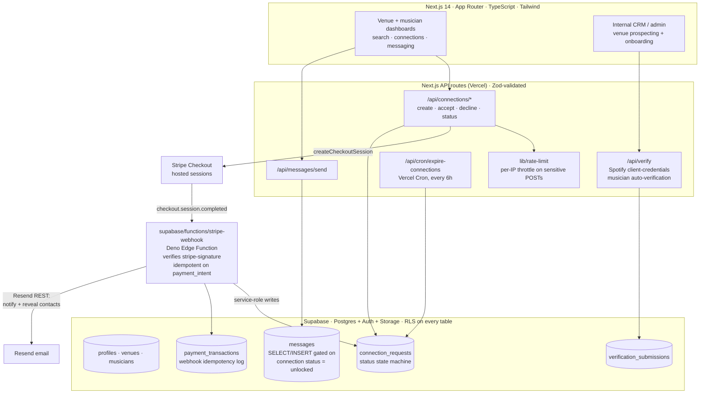
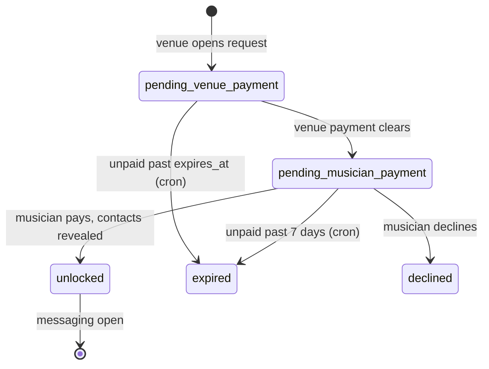

# GigLocal

A two-sided marketplace that connects live-music venues with local musicians. The signature mechanic is a **mutual, paid "connection unlock"**: contact details and direct messaging stay hidden until *both* sides have paid, enforced as a payment state machine with the paywall pushed all the way down into the database.

Built solo under NerdJoy LLC. This is an architecture overview; the source is private.

## What it is

Venues (bars, breweries, restaurants, halls) and musicians each have profiles. A venue that wants to book a musician opens a connection request and pays a small unlock fee; the musician pays a matching fee to accept. Only when both payments clear does the platform reveal contact information and open a direct-message thread. A built-in CRM (separate auth, separate tables) handles venue prospecting and onboarding, and a standalone landing site runs the waitlist.

## Architecture

## The signature flow: two-sided payment unlock

Contact info is escrowed behind a symmetric paywall. The `connection_requests` row is a strict state machine (a Postgres `CHECK` constraint enforces the allowed statuses), and each transition is driven by a signature-verified, idempotent Stripe webhook, not by client code.

1. **Venue initiates.** `POST /api/connections/create` authenticates, rate-limits, inserts a `connection_requests` row at `pending_venue_payment`, and creates a Stripe Checkout Session (purpose `venue_unlock`).
2. **Webhook advances state.** Stripe fires `checkout.session.completed` to the Deno Edge Function `stripe-webhook`. It verifies the `stripe-signature`, checks the `payment_intent` against `payment_transactions` for idempotency, logs the transaction, sets `venue_paid = true`, flips status to `pending_musician_payment`, stamps a 7-day `expires_at`, and emails the musician.
3. **Musician accepts and pays.** `POST /api/connections/accept` creates the second Checkout Session (purpose `musician_unlock`).
4. **Mutual unlock.** The second webhook sets `musician_paid = true`; when both flags are true the status moves to `unlocked`, `unlocked_at` is stamped, and both parties are emailed each other's contact details. Only now do the RLS policies on `messages` permit a thread.
5. **Expiry.** A Vercel Cron job runs `/api/cron/expire-connections` every six hours to expire stale, unpaid requests past `expires_at`.

## Design decisions worth calling out

- **The paywall lives in the database, not the app.** Row Level Security is on every table, and the `messages` SELECT/INSERT policies require the parent `connection_requests.status = 'unlocked'`. Even a bug in the app layer cannot leak a conversation before both sides pay, because Postgres itself refuses the row.
- **Payment logic runs in a Supabase Edge Function, decoupled from the app deploy.** Stripe webhooks need a stable, signature-verified endpoint that does not churn with front-end deploys. The Deno function verifies the signature and mutates state with the service-role key; it calls Resend over raw REST to avoid bundling an npm client into the Deno runtime.
- **Idempotent by construction.** Stripe retries webhooks. Before mutating anything, the handler checks whether the `payment_intent` already exists in `payment_transactions` and short-circuits, so retries never double-charge state or send duplicate emails.
- **`connection_requests` is an explicit state machine.** A `CHECK`-constrained `status` column plus paid-flag booleans model an escrow-style handshake, which keeps "who owes what next" unambiguous across two payers and asynchronous webhooks.
- **Two auth models in one codebase.** End users (venues, musicians) use Supabase email/password auth; internal staff use magic-link auth gated by a `crm_users` email allowlist. Both are enforced centrally in `middleware.ts`, and prospect leads live in their own tables so outreach data never mixes with real signed-up users.
- **No external search or verification services.** Musician discovery uses Postgres-native full-text search (a generated `tsvector` column with a GIN index), and musician verification hits the Spotify client-credentials API directly, with a human review queue behind it. Fewer moving parts, fewer bills.

## Stack

Next.js 14 (App Router) · React 18 · TypeScript 5 · Tailwind CSS 3.4. Supabase (Postgres, Auth, Storage, one Deno Edge Function). Stripe Checkout for hosted two-sided payments. Resend for transactional email. Zod for input validation. Spotify Web API for musician auto-verification. Playwright for end-to-end and API tests. Deployed on Vercel with Vercel Cron.

## Status

Built and operated solo under NerdJoy LLC. Architecture overview only; the full source lives in a private repository. Happy to walk through the payment state machine, the RLS model, or the webhook design in detail.
